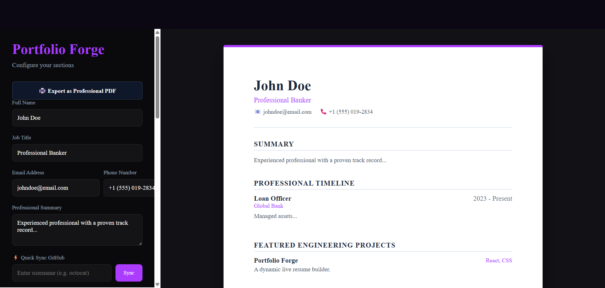

## PortfolioForge

A website which helps people get their portfolio in minutes without writing a single line of code or any designing tool.

## Own Story :

My Dad is a corporate person who updates his portfolio every year but whenever he wants to update due to lack of coding and designing skills, he gets to HR to have a crisp portfolio. In my outreach there are many people who gets to the HR. I noticed this and using my frontend skill, I created this app for my people who actually can design by their own.

## Tech Stack:

1. React
2. CSS

I have used React Router for Routing purpose.

## File Structure:

--> All the pages, assets, styles are in Components, Assets, and Styles folder respectively.

## Steps to Start:

1. You can click Get Started Button.
2. You will land on the Dashboard page and can see a form in the left panel.
3. Fill out the specific details.
4. Sync your Github account or Optimize your portfolio via AI (optional).
5. Select the Theme of your choice.
6. Click on the export button at the top of the page.

## Demo Link:

## Website Working Image:

;

## Note:

I tried my best to present this Readme, it was my another attempt to write a readme by my own.

## Review:

For any kind of review you can mail me at 'srishti.pixelmind@gmail.com' OR 'srishti.school2010@gmail.com'.

## Thank You So Much For Giving Your Precious Time To Us!!
